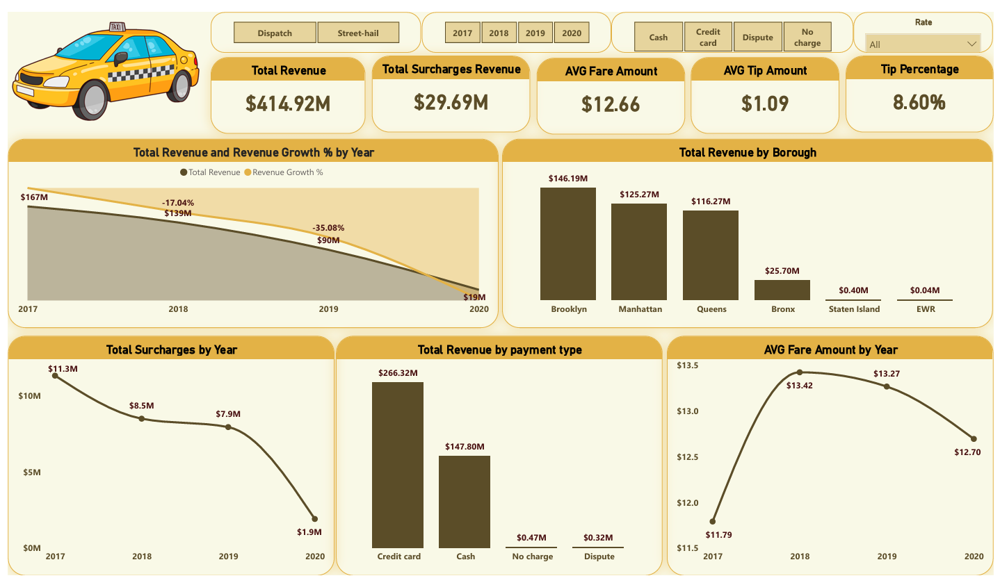
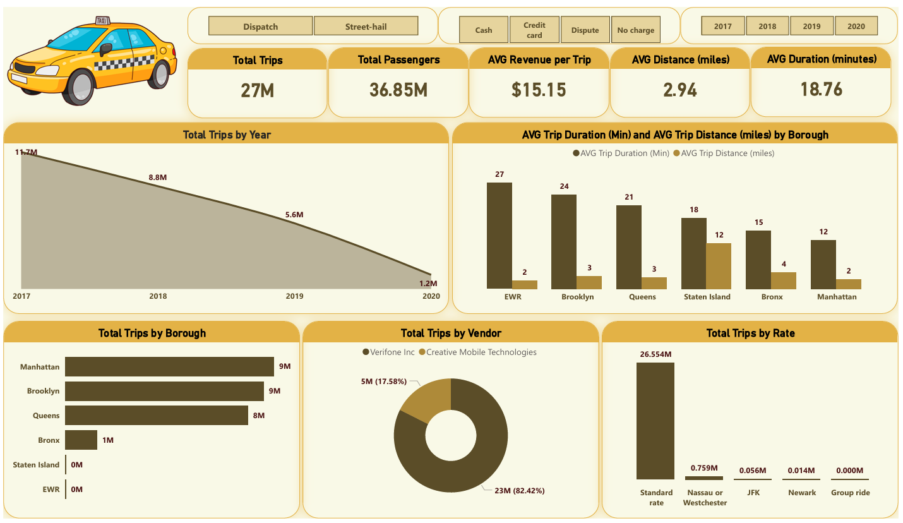

# 🚖 NYC Taxi Data Analysis Dashboard

## Project Overview
This project provides a comprehensive analysis of NYC Taxi trip data. The goal is to assist the operational team and stakeholders in understanding revenue streams, trip patterns, and passenger preferences to improve efficiency.

## Key Objectives
1.  **Revenue Analysis:** Identify trends in revenue over years and months.
2.  **Operational Insights:** Analyze trip duration, distance, and passenger counts.
3.  **Performance Tracking:** Compare payment methods and vendor performance.

## Tools Used
* **Power BI:** For building interactive dashboards.
* **DAX (Data Analysis Expressions):** For complex calculations (e.g., Revenue Growth, Avg Duration).
* **Power Query:** For data cleaning and transformation.

## Key Insights (From Analysis)
* **Revenue Trends:** Noticed a significant dip in 2020 due to global restrictions.
* **Payment Methods:** Credit cards are the dominant payment method, significantly outperforming cash.
* **The EWR Anomaly:** Identified that trips involving Newark Airport (EWR) have high duration avg (27 mins) but very short recorded distance, suggesting high congestion or inter-terminal transit.
* **Peak Locations:** Manhattan and Brooklyn account for the majority of pickups and revenue.

## 📸 Dashboard Screenshots
### 1. Financial View (Revenue & Growth)

### 2. Operational View (Trips & Volume)

## 📂 Dataset
The dataset includes trip records from NYC Taxi & Limousine Commission, containing fields for pickup/dropoff dates, locations, fares, and payment types.
Dataset link: https://mavenanalytics.io/challenges/maven-taxi-challenge
